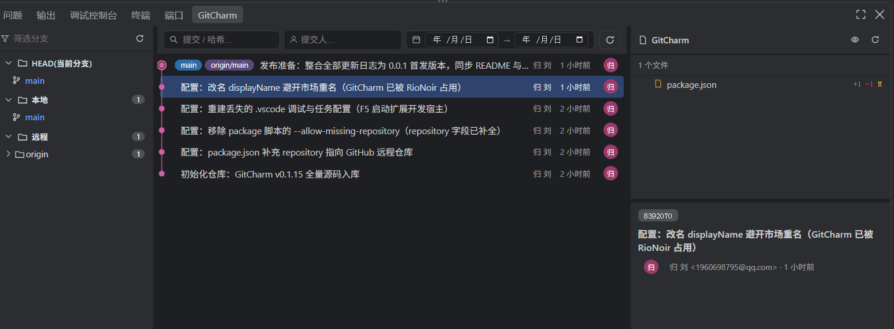

# GitCharm

> 在 VSCode / Qoder 中复刻 IntelliJ IDEA 的 Git UI 与工作流。



如上图所示，GitCharm 提供一个三栏式的 Git 日志面板：

- **左栏 · 分支树**：按 `HEAD / 本地 / 远程` 分组的层级树，带超前/落后箭头（▲▼）与提交数徽标
- **中栏 · 提交列表**：Canvas 绘制的提交图谱，含消息首行、作者头像、相对时间，支持消息 / 提交人 / 日期区间筛选
- **右栏 · 提交详情**：选中提交的完整信息、变更文件列表（增删行数）与差异入口

## 特性一览

### Git 操作

- **分支**：新建、检出、重命名、删除、合并到当前分支、变基到…、推送、拉取、获取、更新（非当前分支可快进时安全更新）
- **提交**：显示差异、精选提交（Cherry-Pick，支持多选批量 + 冲突持久化恢复）、交互式变基、压缩提交、删除提交、编辑提交信息、重置到此提交
- **文件**：与其他分支对比此文件、查看单次提交引入的差异
- **Blame**：行内注解每行的最后修改者与日期，悬停查看完整提交信息，点击跳转到对应提交

### 性能

- **秒开**：三阶段渐进式加载（骨架屏 → 分支 → 提交），启动 < 10ms
- **直读 refs**：直接解析 `.git/refs`（loose + packed-refs），数百分支也不卡死，避免大量 `git rev-parse` 子进程
- **智能缓存**：分支信息持久化到工作区状态（Memento），重启后立即可用；Git 操作后自动失效更新
- **Canvas 图谱**：提交图用 Canvas 像素级绘制，高 DPI 自适应，比 SVG/DOM 高效数倍

### 体验与可靠性

- **中英双语**：界面全量本地化，跟随编辑器语言或手动指定
- **IDEA 风格视觉**：圆角 6–12px、平滑过渡、悬停微动效、tag 黄色徽章
- **变基前检查**：自动检测未提交更改，避免变基失败
- **冲突统一处理**：合并 / 变基 / 精选冲突统一检测，顶部状态栏提供"继续 / 终止"，冲突自动交原生 SCM 视图解决
- **无 shell 命令执行**：所有 git 命令走 argv `spawn`，杜绝参数注入

## 环境要求

- **VSCode** ≥ 1.95.0，或 **Qoder** 最新版
- **Git** ≥ 2.0.0
- 内置 **vscode.git** 扩展保持启用（默认开启）

## 安装

### 方式一：扩展市场（推荐）

在 VSCode / Qoder 扩展面板搜索 **GitCharm**（完整名 *GitCharm — IDEA Git Log & Graph*，发布者 `liugui`）并安装。

### 方式二：VSIX 离线安装

1. 下载 `git-charm-<版本>.vsix`
2. 命令面板执行 **Extensions: Install from VSIX…**
3. 选择文件，重新加载窗口

## 使用方法

1. 打开一个 Git 仓库工作区
2. 在底部面板点击 **GitCharm** 标签（面板标题栏），即可看到三栏日志视图
3. 树节点：文件夹单击展开、分支**双击切换**；右键节点或提交行呼出对应操作菜单

### 常用操作

| 操作 | 入口 |
|------|------|
| 切换分支 | 分支树双击分支，或右键 → 检出 |
| 查看提交详情 | 单击中栏提交行 |
| 查看提交差异 | 提交行右键 → 显示差异 |
| 合并 / 变基 | 分支右键 → 合并到当前分支 / 变基到… |
| 推送 / 拉取 | 分支右键 → 推送 / 拉取 |
| 精选提交 | 多选提交 → 右键 → 精选提交 |
| 压缩 / 交互式变基 | 多选提交 → 右键 → 压缩提交 / 交互式变基 |
| 删除 / 改提交信息 | 提交行右键（仅 HEAD 附近可用） |
| 对比文件 | 编辑器 / 资源管理器右键 → 与其他分支对比此文件 |
| 显示 Blame | 编辑器右键 → 显示提交信息，或点击行号区域 |

## 设置项

在设置中搜索 `idea-git` 可调整：

| 配置 | 说明 | 默认 |
|------|------|------|
| `idea-git.cache.enabled` | 启用分支信息缓存以提高启动速度（缓存持久保存，仅在仓库变化或执行 Git 操作时更新） | `true` |
| `idea-git.pullStrategy` | 拉取远程分支的更新策略：`merge`（合并式）或 `rebase`（变基式） | `merge` |
| `idea-git.language` | 界面显示语言：`auto` / `zh-cn` / `en` | `auto` |
| `idea-git.debug` | 启用调试日志（输出到扩展宿主控制台） | `false` |

## 开发

```bash
npm install        # 安装依赖（含 @vscode/vsce）
npm run compile    # TypeScript 编译到 out/
npm run lint       # ESLint 检查
npm test           # node:test 单元测试
npm run package    # 打包 VSIX
```

在 VSCode / Qoder 中按 **F5** 启动"扩展开发宿主"进行调试（配置见 `.vscode/launch.json`）。

> 提示：改动 `out/` 或 `media/` 后，开发宿主跑的是旧代码，需完全重启宿主再验证。

## 技术栈

TypeScript · VSCode Extension API · Git CLI · Webview（Canvas 渲染）

## 许可证

[MIT](LICENSE)

完整版本历史见 [CHANGELOG.md](CHANGELOG.md)。
