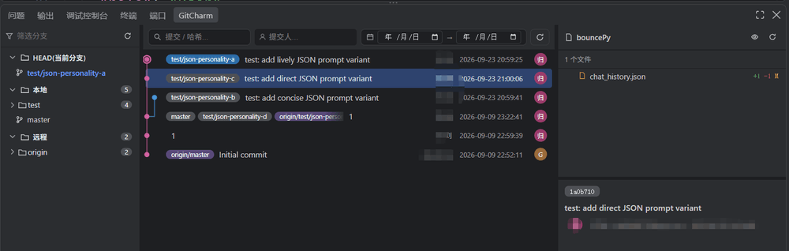
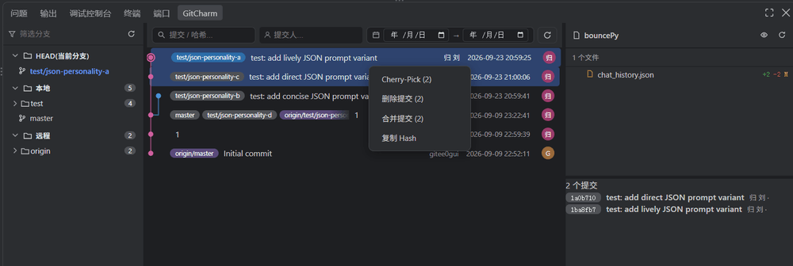
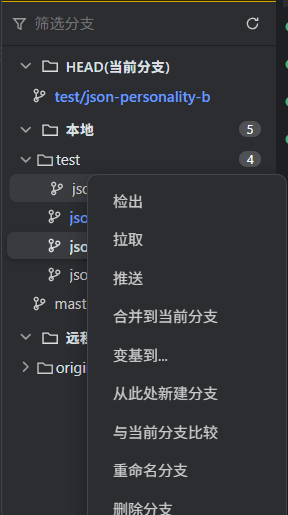
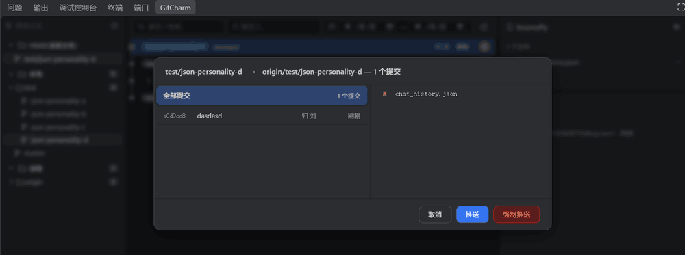
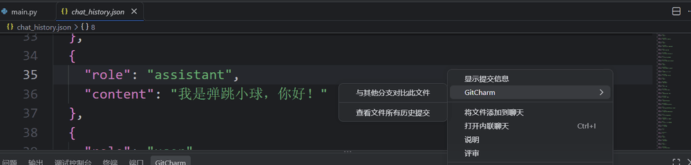
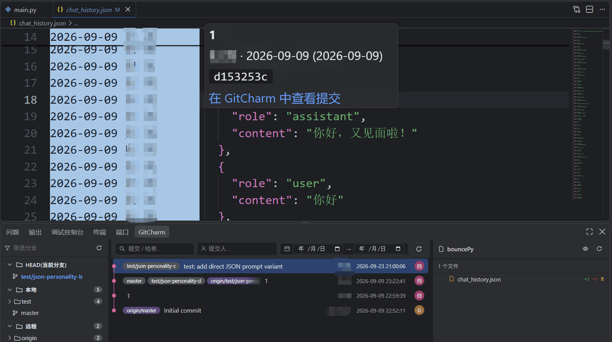
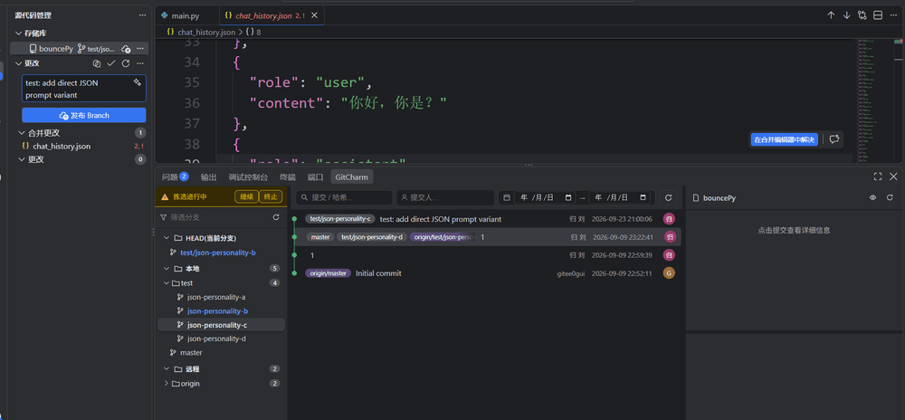

# GitCharm

**English** | [简体中文](#简体中文)

> Bring the IntelliJ IDEA Git UI and workflow to VSCode / Qoder.



GitCharm provides a three-panel Git log view:

- **Left · Branch tree** — hierarchical tree grouped by `HEAD / Local / Remote`, with ahead/behind arrows (▲▼) and commit-count badges
- **Center · Commit list** — Canvas-rendered commit graph showing message first line, author avatar and relative time, with message / author / date-range filters
- **Right · Commit details** — full commit info, changed file list (added/deleted line counts) and diff entry

## Screenshots

**Commit context menu (single)** — right-click a commit row for Show Diff / Cherry-Pick / Reset / New Branch, plus Amend message & Drop on HEAD


**Commit context menu (multi-select)** — select several commits then right-click for batch Cherry-Pick / Drop / Squash



**Branch context menu** — right-click a branch node for Checkout / Rename / Delete / Merge / Rebase / Push / Pull



**Push dialog** — review outgoing commits and their changed files before pushing (force-push available when behind)



**Editor context menu** — GitCharm actions available from the code editor right-click



**Blame gutter** — click a line number to reveal the last commit that touched it, with a jump-to-commit link



**Conflict handling** — merge / rebase / cherry-pick conflicts surface in a persistent status bar with Continue / Abort



## Features

### Git Operations

- **Branches**: create, checkout, rename, delete, merge into current, rebase onto, push (force push offered when behind the remote), pull, fetch, update (safe fast-forward for non-current branches)
- **Commits**: show diff, cherry-pick (multi-select batch + conflict-resumable), squash, drop commit, amend message, reset to commit
- **Files**: compare file with another branch, compare with the local working copy, pick a single file from a commit, view every commit that touched a file (cross-branch), view diff introduced by a single commit
- **Blame**: inline annotation of last author & date per line, full commit info on hover, click to jump to the commit

### Performance

- **Instant open**: three-phase progressive loading (skeleton → branches → commits), startup < 10ms
- **Filesystem refs**: parses `.git/refs` (loose + packed-refs) directly — hundreds of branches stay smooth, no flood of `git rev-parse` subprocesses
- **Smart cache**: branch info persisted to workspace state (Memento), instantly available after restart; invalidated on Git operations
- **Canvas graph**: pixel-precise commit graph rendered on Canvas with high-DPI support, several times faster than SVG/DOM

### Experience & Reliability

- **Bilingual UI**: fully localized interface, follows editor language or set manually
- **Session restore**: reopening the panel within a couple of hours brings back the last selected branch, commit and its file list
- **Ahead/behind arrows**: shown for branches that differ from their remote twin, including those without a configured upstream
- **IDEA-style visuals**: 6–12px radii, smooth transitions, hover micro-animations, yellow tag badges
- **Pre-rebase check**: detects uncommitted changes before rebasing to avoid failures
- **Unified conflict handling**: merge / rebase / cherry-pick conflicts detected in one place, top status bar with Continue / Abort, conflicts delegated to the native SCM view
- **Shell-free execution**: every git command runs via argv `spawn`, eliminating argument injection

## Requirements

- **VSCode** ≥ 1.95.0, or **Qoder** latest
- **Git** ≥ 2.0.0
- Built-in **vscode.git** extension enabled (default)

## Installation

### From the Marketplace (recommended)

Search **GitCharm** in the extensions panel (full name *GitCharm — IDEA Git Log & Graph*, publisher `liugui`) and install.

### From a VSIX file

1. Download `git-charm-<version>.vsix`
2. Run **Extensions: Install from VSIX…** from the command palette
3. Pick the file and reload the window

## Usage

1. Open a workspace containing a Git repository
2. Click the **GitCharm** tab in the bottom panel to reveal the three-panel log view
3. Tree nodes: single-click folders to expand, **double-click a branch to switch**; right-click a node or commit row for context actions

### Common Actions

| Action | Entry |
|--------|-------|
| Switch branch | Double-click branch in tree, or right-click → Checkout |
| View commit details | Click a commit row |
| Show commit diff | Right-click commit → Show Diff |
| Merge / Rebase | Right-click branch → Merge into Current / Rebase onto |
| Push / Pull | Right-click branch → Push / Pull |
| Cherry-pick | Multi-select commits → right-click → Cherry-Pick |
| Squash | Multi-select commits → right-click → Squash |
| Drop / Amend commit | Right-click commit row (only near HEAD) |
| Compare file with branch | Editor / Explorer right-click → GitCharm → Compare with Branch |
| Compare file with local copy | Commit detail (third panel) → double-click a file, or right-click → Compare with Local File |
| Pick a file from a commit | Commit detail (third panel) → right-click a file → Cherry-Pick File |
| View file history | Editor / Explorer right-click → GitCharm → View File History |
| Toggle blame | Editor right-click → Toggle Blame, or click the line-number area |

## Settings

Search `idea-git` in settings:

| Setting | Description | Default |
|---------|-------------|---------|
| `idea-git.cache.enabled` | Cache branch info for faster startup (persisted; refreshed on repo changes or Git operations) | `true` |
| `idea-git.pullStrategy` | Update strategy when pulling: `merge` or `rebase` | `merge` |
| `idea-git.language` | UI language: `auto` / `zh-cn` / `en` | `auto` |
| `idea-git.debug` | Enable debug logging to the extension host console | `false` |

## Development

```bash
npm install        # install dependencies (includes @vscode/vsce)
npm run compile    # compile TypeScript to out/
npm run lint       # ESLint
npm test           # node:test unit tests
npm run package    # build VSIX
```

Press **F5** in VSCode / Qoder to launch the Extension Development Host (config in `.vscode/launch.json`).

> Note: after changing `out/` or `media/`, fully restart the development host — it runs the previously loaded code.

## Tech Stack

TypeScript · VSCode Extension API · Git CLI · Webview (Canvas rendering)

## License

[MIT](LICENSE) · Full history in [CHANGELOG.md](CHANGELOG.md)

---

# 简体中文

> 在 VSCode / Qoder 中复刻 IntelliJ IDEA 的 Git UI 与工作流。


GitCharm 提供一个三栏式的 Git 日志面板：

- **左栏 · 分支树**：按 `HEAD / 本地 / 远程` 分组的层级树，带超前/落后箭头（▲▼）与提交数徽标
- **中栏 · 提交列表**：Canvas 绘制的提交图谱，含消息首行、作者头像、相对时间，支持消息 / 提交人 / 日期区间筛选
- **右栏 · 提交详情**：选中提交的完整信息、变更文件列表（增删行数）与差异入口

## 界面截图

**提交右键菜单（单选）**：提交行右键呼出 显示差异 / 精选提交 / 重置 / 新建分支，HEAD 附近另有 编辑提交信息 与 删除提交


**提交右键菜单（多选）**：多选提交后右键，批量 精选提交 / 删除提交 / 合并提交


**分支右键菜单**：分支节点右键呼出 检出 / 重命名 / 删除 / 合并 / 变基 / 推送 / 拉取


**推送对话框**：推送前查看待推送提交及其变更文件（落后远程时可强制推送）


**编辑器右键菜单**：代码编辑器右键可用的 GitCharm 操作


**行号 Blame**：点击行号查看该行的最后一次提交，并提供跳转到提交的链接


**冲突处理**：合并 / 变基 / 精选冲突统一在顶部持久状态栏提示，提供 继续 / 终止


## 特性一览

### Git 操作

- **分支**：新建、检出、重命名、删除、合并到当前分支、变基到…、推送（落后远程时提供强制推送）、拉取、获取、更新（非当前分支可快进时安全更新）
- **提交**：显示差异、精选提交（Cherry-Pick，支持多选批量 + 冲突持久化恢复）、压缩提交、删除提交、编辑提交信息、重置到此提交
- **文件**：与其他分支对比此文件、与当前本地文件对比、从提交中挑选单个文件、跨分支查看该文件的全部历史提交、查看单次提交引入的差异
- **Blame**：行内注解每行的最后修改者与日期，悬停查看完整提交信息，点击跳转到对应提交

### 性能

- **秒开**：三阶段渐进式加载（骨架屏 → 分支 → 提交），启动 < 10ms
- **直读 refs**：直接解析 `.git/refs`（loose + packed-refs），数百分支也不卡死，避免大量 `git rev-parse` 子进程
- **智能缓存**：分支信息持久化到工作区状态（Memento），重启后立即可用；Git 操作后自动失效更新
- **Canvas 图谱**：提交图用 Canvas 像素级绘制，高 DPI 自适应，比 SVG/DOM 高效数倍

### 体验与可靠性

- **中英双语**：界面全量本地化，跟随编辑器语言或手动指定
- **会话恢复**：短时间内重新打开面板自动恢复上次所选分支、提交及其文件列表（2 小时窗口）
- **超前/落后箭头**：与远程同名分支有差异即显示，未配置 upstream 的分支同样计算
- **IDEA 风格视觉**：圆角 6–12px、平滑过渡、悬停微动效、tag 黄色徽章
- **变基前检查**：自动检测未提交更改，避免变基失败
- **冲突统一处理**：合并 / 变基 / 精选冲突统一检测，顶部状态栏提供"继续 / 终止"，冲突自动交原生 SCM 视图解决
- **无 shell 命令执行**：所有 git 命令走 argv `spawn`，杜绝参数注入

## 环境要求

- **VSCode** ≥ 1.95.0，或 **Qoder** 最新版
- **Git** ≥ 2.0.0
- 内置 **vscode.git** 扩展保持启用（默认开启）

## 安装

### 方式一：扩展市场（推荐）

在 VSCode / Qoder 扩展面板搜索 **GitCharm**（完整名 *GitCharm — IDEA Git Log & Graph*，发布者 `liugui`）并安装。

### 方式二：VSIX 离线安装

1. 下载 `git-charm-<版本>.vsix`
2. 命令面板执行 **Extensions: Install from VSIX…**
3. 选择文件，重新加载窗口

## 使用方法

1. 打开一个 Git 仓库工作区
2. 在底部面板点击 **GitCharm** 标签，即可看到三栏日志视图
3. 树节点：文件夹单击展开、分支**双击切换**；右键节点或提交行呼出对应操作菜单

### 常用操作

| 操作 | 入口 |
|------|------|
| 切换分支 | 分支树双击分支，或右键 → 检出 |
| 查看提交详情 | 单击中栏提交行 |
| 查看提交差异 | 提交行右键 → 显示差异 |
| 合并 / 变基 | 分支右键 → 合并到当前分支 / 变基到… |
| 推送 / 拉取 | 分支右键 → 推送 / 拉取 |
| 精选提交 | 多选提交 → 右键 → 精选提交 |
| 压缩提交 | 多选提交 → 右键 → 压缩提交 |
| 删除 / 改提交信息 | 提交行右键（仅 HEAD 附近可用） |
| 与其他分支对比文件 | 编辑器 / 资源管理器右键 → GitCharm → 与其他分支对比此文件 |
| 与本地文件对比 | 第三栏变更文件双击，或右键 → 与当前本地文件对比 |
| 挑选提交中的单个文件 | 第三栏变更文件右键 → 挑选文件 |
| 查看文件所有历史提交 | 编辑器 / 资源管理器右键 → GitCharm → 查看文件所有历史提交 |
| 显示 Blame | 编辑器右键 → 显示提交信息，或点击行号区域 |

## 设置项

在设置中搜索 `idea-git` 可调整：

| 配置 | 说明 | 默认 |
|------|------|------|
| `idea-git.cache.enabled` | 启用分支信息缓存以提高启动速度（缓存持久保存，仅在仓库变化或执行 Git 操作时更新） | `true` |
| `idea-git.pullStrategy` | 拉取远程分支的更新策略：`merge`（合并式）或 `rebase`（变基式） | `merge` |
| `idea-git.language` | 界面显示语言：`auto` / `zh-cn` / `en` | `auto` |
| `idea-git.debug` | 启用调试日志（输出到扩展宿主控制台） | `false` |

## 开发

```bash
npm install        # 安装依赖（含 @vscode/vsce）
npm run compile    # TypeScript 编译到 out/
npm run lint       # ESLint 检查
npm test           # node:test 单元测试
npm run package    # 打包 VSIX
```

在 VSCode / Qoder 中按 **F5** 启动"扩展开发宿主"进行调试（配置见 `.vscode/launch.json`）。

> 提示：改动 `out/` 或 `media/` 后，开发宿主跑的是旧代码，需完全重启宿主再验证。

## 技术栈

TypeScript · VSCode Extension API · Git CLI · Webview（Canvas 渲染）

## 许可证

[MIT](LICENSE)

完整版本历史见 [CHANGELOG.md](CHANGELOG.md)。
